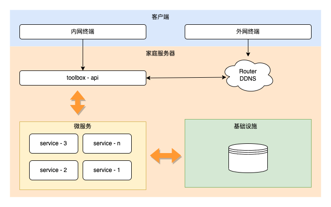

# toolbox

一个玩具工具箱(restful最佳实践, api模板)

## control

```shell
./control.sh {start|stop|restart|status}
```


## todo list

- [ ] 认证
- [ ] 密码管理（存储、检索、对接alfred） 
- [ ] 笔记管理
- [ ] DDNS服务
- [ ] 路由管理
- [ ] 计划任务
- [ ] 容器服务
- [ ] 下载服务
- [ ] 网盘服务
- [ ] 媒体服务
- [ ] 时间机器
- [ ] 内网穿透


## system architecture (draft)


